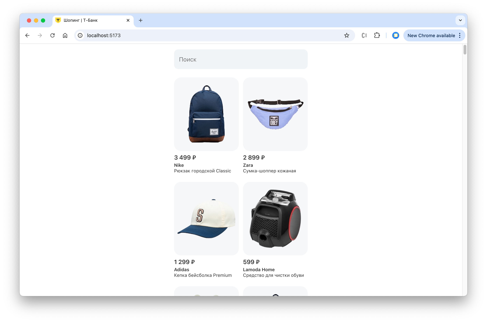
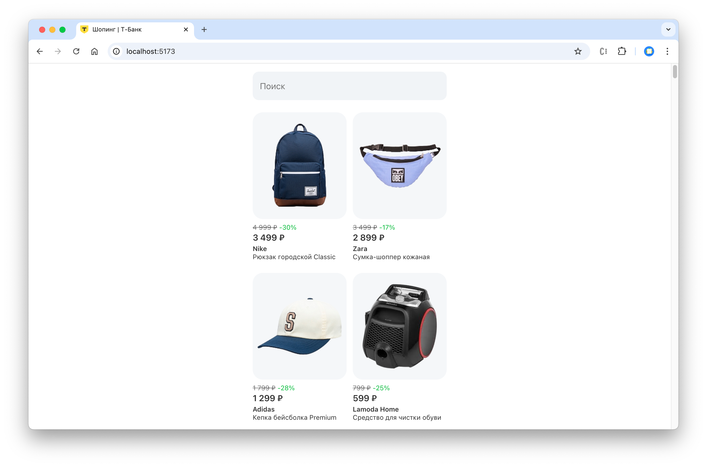

# Вступление

В рамках данной работы мы сделаем витрину товаров. Кейс основан на реальных рабочих задачах сотрудников Т-Банка. 
Репозиторий содержит шаблон веб-приложения в стилистике компании, вам необходимо доработать функционал.

### Как выполнять задание

Практическая работа разбита на 3 шага по мере возврастания сложности, шаг может быть дополнительно разбит на несколько ступеней.
Для каждого шага будет дано описание задания и основные тезисы.

Далее предоставлено подробное описание решения, однако рекомендуется сначала попробовать справиться самим.
Для каждого шага есть готовое решение, которое находится в ветке репозитория `steps/step-<номер-шага>`.

### Описание базовой структуры

В качестве базового шаблона и сборщика проекта используется [vite](https://vite.dev/). 
Он нужен, чтобы собирать исходный код в формат, понятный браузеру и запускать локальный сервер.

В описании структуры опущены технические файлы и директории, необходимые для работы приложения, 
ограничимся описанием рабочего функционала.

```
/public – хранение статичных файлов: картинок, шрифтов
/src – исходный код приложения
    /_lib – вспомогательный функционал для данной работы: функция вызова мок-запроса и датасеты
    /api-logic – логика работы с API: вызов запросов и обработка данных
    /app – главный компонент приложения, где объединяется логика и визуал
    /components – визуальные компоненты приложения, не должны содержать логику
        /Badge – бейдж кэшбэка
        /icons – иконки
        /Input – поле ввода теста
        /Product – карточка товара
    /utils – вспомогательные утилиты
    /index.css – общие стили приложения
    /main.jsx – рендер приложения в html
index.html – основной файл веб-страницы, в который подключаются стили, скрипты, и рендерится приложение
```

### Запуск приложения

Для запуска вам нужно установить [Node.js](https://nodejs.org/en) и npm (устанавливается вместе с node).
Необходимо склонировать себе репозиторий, открыть в терминале / командной строке и выполнить команды:

```shell
npm install
npm run dev
```

Запущенное приложение будет доступно по адресу http://localhost:5173/. 
При открытии ссылки вы должны увидеть начальное состояние приложения.



# Задание

###  Шаг 1. Отображение старой цены и скидки

На данном этапе мы отображаем только текущую цену, однако мы получим больше шансов заинтересовать пользователя,
если подсветим ему, что в данный момент на товар действует скидка.

Если внимательнее взглянуть на данные в датасете по пути `src/_lib/data/products.json`, мы увидим структуру данных товаре:

```json5
{
  "id": "4823247662312403629",
  "name": "Рюкзак городской Classic",
  "brand": "Nike",
  "price": 3499, // текущая цена товара
  "oldPrice": 4999, // старая цена товара
  "imageUrl": "/products/backpack-2.png"
}
```

Компонент карточки товара `src/components/Product/Product.jsx` принимает следующие аргументы:

```
price – цена
oldPrice – старая цена
discount – процент скидки (со знаком минус)
```

Запрос данных о товаре происходит в `src/api-logic/getProducts.js`, полученные товары отображаются в `src/app/App.jsx`.

#### Задача

- Подумайте, как можно расчитать процент скидки, имея старую и новую цену.
- Передайте параметры старой цены и скидки в отображение товара.
- \* Подумайте, в каком месте грамотнее расчитывать скидку.

Ожидаемое состояние приложения после выполнения шага:



#### Решение

> Для начала попробуйте справиться сами! Используйте решение для самопроверки.

<details>
  <summary>Показать решение</summary>

  Для расчета скидки можно использовать алгоритм:
  
  - поделить новую цену на старую, чтобы узнать, какой процент от старой цены составляет новая;
  - вычесть полученное число из 1, чтобы узнать, на какую часть новая цена отличается от старой;
  - умножить полученное число на 100, чтобы преобразовать десятичную дробь в процент;
  - округлить процент до целых, используя математическое окгруление;
  - представить полученное значение со знаком минус в соответствии с требованием компонента;

  Алгоритм можно представить в виде формулы

  ```javascript
  -Math.round((1 - (price / oldPrice)) * 100)
  ```

  Так как для обработки данных, полученных от API используется функция `api-logic/getProducts.js`, 
  расчитывать скидку для каждого товара нужно именно там. 
  
  Для модификации элементов массива и сохранением в новый массив
  используется функция `array.map`.

  Для добавления новых полей в объект используется синтаксис 
  ```javascript
  const newObject = { ...myObject, newProperty: 'some value' };
  ```

  Таким образом, можно модифицировать функцию `getProducts`, добавив в нее рассчет скидки:

  ```javascript
  export async function getProducts() {
    const response = await mockFetch('https://mockapi.local/products');
    const data = await response.json();
  
    return data.products.map((product) => {
      const discount = -Math.round((1 - (product.price / product.oldPrice)) * 100);
  
      return {
        ...product,
        discount,
      }
    });
  }
  ```

  Теперь осталось лишь передать новые данные в компонент `<Product />` в файле `App.jsx`:

  ```jsx
  <Product
    key={product.id}
    imageUrl={product.imageUrl}
    price={product.price}
    oldPrice={product.oldPrice}
    discount={product.discount}
    brand={product.brand}
    name={product.name}
  />
  ```
</details>