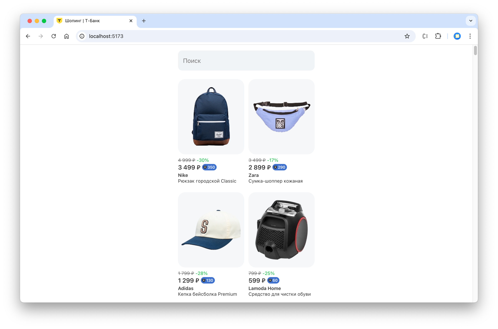

# Вступление

В рамках данной работы мы сделаем витрину товаров. Кейс основан на реальных рабочих задачах сотрудников Т-Банка. 
Репозиторий содержит шаблон веб-приложения в стилистике компании, вам необходимо доработать функционал.

### Как выполнять задание

Практическая работа разбита на 3 шага по мере возврастания сложности.
Для каждого шага будет дано описание задач и основные тезисы. 
Могут встречаться задачи со звездочкой – они не обязательны, но могут быть интересны.

Далее предоставлено подробное описание решения, однако рекомендуется сначала попробовать справиться самим.
Для каждого шага есть готовое решение, которое находится в ветке репозитория `steps/step-<номер-шага>`.

### Описание базовой структуры

В качестве базового шаблона и сборщика проекта используется [vite](https://vite.dev/). 
Он нужен, чтобы собирать исходный код в формат, понятный браузеру и запускать локальный сервер.

В описании структуры опущены технические файлы и директории, необходимые для работы приложения, 
ограничимся описанием рабочего функционала.

```
/public – хранение статичных файлов: картинок, шрифтов
/src – исходный код приложения
    /_lib – вспомогательный функционал для данной работы: функция вызова мок-запроса и датасеты
    /api-logic – логика работы с API: вызов запросов и обработка данных
    /app – главный компонент приложения, где объединяется логика и визуал
    /components – визуальные компоненты приложения, не должны содержать логику
        /Badge – бейдж кэшбэка
        /icons – иконки
        /Input – поле ввода теста
        /Product – карточка товара
    /utils – вспомогательные утилиты
    /index.css – общие стили приложения
    /main.jsx – рендер приложения в html
index.html – основной файл веб-страницы, в который подключаются стили, скрипты, и рендерится приложение
```

### Запуск приложения

Для запуска вам нужно установить [Node.js](https://nodejs.org/en) и npm (устанавливается вместе с node).
Необходимо склонировать себе репозиторий, открыть в терминале / командной строке и выполнить команды:

```shell
npm install
npm run dev
```

Запущенное приложение будет доступно по адресу http://localhost:5173/. 
При открытии ссылки вы должны увидеть начальное состояние приложения.


# Задание

###  Шаг 1. Отображение старой цены и скидки

На данном этапе мы отображаем только текущую цену, однако мы получим больше шансов заинтересовать пользователя,
если подсветим ему, что в данный момент на товар действует скидка.

Если внимательнее взглянуть на данные в датасете по пути `src/_lib/data/products.json`, мы увидим структуру данных товаре:

```json5
{
  "id": "4823247662312403629",
  "name": "Рюкзак городской Classic",
  "brand": "Nike",
  "price": 3499, // текущая цена товара
  "oldPrice": 4999, // старая цена товара
  "imageUrl": "/products/backpack-2.png"
}
```

Компонент карточки товара `src/components/Product/Product.jsx` принимает следующие аргументы:

```
price – цена
oldPrice – старая цена
discount – процент скидки (со знаком минус)
```

Запрос данных о товаре происходит в `src/api-logic/getProducts.js`, полученные товары отображаются в `src/app/App.jsx`.

#### Задача

- подумайте, как можно расчитать процент скидки, имея старую и новую цену;
- реализуйте расчет скидки для каждого товара в `getProducts`;
- передайте параметры старой цены и скидки в отображение товара в `<App />`;
- \* подумайте, в каком месте грамотнее расчитывать скидку;

Ожидаемое состояние приложения после выполнения шага:


#### Решение

> Для начала попробуйте справиться сами! Используйте решение для самопроверки.

<details>
  <summary>Показать решение</summary>

  Для расчета скидки можно использовать алгоритм:
  
  - поделить новую цену на старую, чтобы узнать, какой процент от старой цены составляет новая;
  - вычесть полученное число из 1, чтобы узнать, на какую часть новая цена отличается от старой;
  - умножить полученное число на 100, чтобы преобразовать десятичную дробь в процент;
  - округлить процент до целых, используя математическое окгруление;
  - представить полученное значение со знаком минус в соответствии с требованием компонента;

  Алгоритм можно представить в виде формулы

  ```javascript
  -Math.round((1 - (price / oldPrice)) * 100)
  ```

  Так как для обработки данных, полученных от API используется функция `api-logic/getProducts.js`, 
  расчитывать скидку для каждого товара нужно именно там. 
  
  Для модификации элементов массива и сохранением в новый массив
  используется функция `array.map`.

  Для добавления новых полей в объект используется синтаксис 
  ```javascript
  const newObject = { ...myObject, newProperty: 'some value' };
  ```

  Таким образом, можно модифицировать функцию `getProducts`, добавив в нее рассчет скидки:

  ```javascript
  export async function getProducts() {
    const response = await mockFetch('https://mockapi.local/products');
    const data = await response.json();
  
    return data.products.map((product) => {
      const discount = -Math.round((1 - (product.price / product.oldPrice)) * 100);
  
      return {
        ...product,
        discount,
      }
    });
  }
  ```

  Теперь осталось лишь передать новые данные в компонент `<Product />` в файле `App.jsx`:

  ```jsx
  <Product
    key={product.id}
    imageUrl={product.imageUrl}
    price={product.price}
    oldPrice={product.oldPrice}
    discount={product.discount}
    brand={product.brand}
    name={product.name}
  />
  ```

  #### Дополнительно

  Напомню, что основная задача `getProducts` – запрос к API и обработка запроса, сложные расчеты не лучшее место для этого. 
  Также мы не знаем, понадобятся ли эти расчеты где-то еще, например, в запросах на других страниц.
  Лучшим решением будет вынести наши расчеты в отдельную функцию-утилиту. 
  Для таких функций у нас есть специальное место `src/utils`.

  Создадим там файл `calculateDiscount.js` со следующим содержимым:

  ```javascript
  export function calculateDiscount(price, oldPrice) {
    return -Math.round((1 - (price / oldPrice)) * 100);
  }
  ```

  И заменим наши расчеты в `getProducts` на вызов этой функции:

  ```javascript
  const discount = calculateDiscount(product.price, product.oldPrice);
  ```
</details>

###  Шаг 2. Отображение кэшбэка

Кэшбэк и программы лояльности традиционно являются одним из способов привлечения и удержания клиента.
Наше тестовое API предоставляет нам информацию о кэшбэке пользователя по запросу:

```
https://mockapi.local/cashback
```

Формат ответа на запрос:

```json5
{
  "percent": 10,
  "topBorder": 1000
}
```

Где `percent` – процент кэшбэка, т.е. 10% от суммы товара, а `topBorder` – верхняя граница кэшбэка, 
т.е. ограничение максимальной суммы кэшбэка. Например, товар стоит 30 000 ₽, у пользователя кэшбэк 10%,
получаем сумму кэшбэка 3000 ₽, однако мы должны ограничиться верхней границей кэшбэка в 1000 ₽ и отобразить именно это значение в карточке товара.

Компонент `<Product />` уже принимает кэшбэк в параметр `cashback` с типом данных `number`.
При наличии кэшбэка отображается компонент `<Badge />`

#### Задача

- подумайте, как можно расчитать размер кэшбэка **в рублях**, имея цену товара, процент и верхнюю границу кэшбэка;
- реализуйте функцию для запроса кэшбэка с API в `api-logic`;
- добавьте расчет кэшбэка для каждого товара в `getProducts`;
- передайте параметры кэшбэка в отображение товара в `<App />`;
- \* подумайте, в каком месте грамотнее расчитывать кэшбэк;

Ожидаемое состояние приложения после выполнения шага:



#### Решение

> Для начала попробуйте справиться сами! Используйте решение для самопроверки.

<details>
  <summary>Показать решение</summary>

  Первым делом нужно создать функцию, которая будет вызывать запросы к API по аналогии с `getProducts`.
  Назовем ее `getCashback` и разместим там следующий код:

  ```javascript
  import { mockFetch } from '../_lib/mockFetch.js';

  export async function getCashback() {
    const response = await mockFetch('https://mockapi.local/cashback');
    return await response.json();
  }
  ```

  Так как кэшбэк относится к свойству товара и расчитывается для каждого индивидуально,
  логичнее будет расчитывать его во время получения и обработки товаров в `getProducts`.

  Алгоритм расчета кэшбэка следующий:

  - делим процент кэшбэка на 100 для получения десятичной дроби;
  - умножаем цену товара на полученное число, получаем сумму кэшбэка;
  - сравниваем сумму с верхней границей, заменяем значение при необходимости;
  - округляем до целых по принципу математического округления;

  Можно было бы вызвать `getCashback` прямо в `getProducts`, однако это было бы нарушением нашей архитектуры 
  и увеличило связанность кода, что в дальнейшем усложнит его масштабирование. 
  Поэтому в рамках формирования списка товаров мы можем рассматривать кэшбэк как абстракцию 
  и принимать в аргументах функции. Однако обобщим аргумент до объекта `options`, 
  в который будем передавать наш кэшбэк, чтобы сделать функцию еще более универсальной:

   ```javascript
   export async function getProducts(options) {
    // остальной код
  }
   ```

  Реализуем наш алгоритм внутри `data.products.map`:

  ```javascript
  return data.products.map((product) => {
    // код из предыдущего шага для расчета скидки
  
    let cashback = undefined;
  
    if (options && options.cashback) {
      const { percent, topBorder } = options.cashback;
      cashback = product.price * percent / 100;
  
      if (cashback > topBorder) {
        cashback = topBorder;
      }
  
      cashback = Math.round(cashback);
    }
  
    return {
      ...product,
      discount,
      cashback,
    };
  });
  ```

  В данном коде мы сначала проверяем наличие аргумента `options` и поля `cashback` внутри него.
  Если мы не получили данные – по умолчанию оставляем значение `undefined` для кэшбэка. 
  После всех действий расширяем объект товара значением кэшбэка по аналогии со скидкой.

  Для корректной обработки данных мы должны выстроить наши запросы в цепочку:

  ```
  запрос кэшбэка –> запрос товаров
  ```

  Это несложно благодаря возможности выстраивать промисы в цепочки, модифицируем код `<App />`:

  ```javascript
    useEffect(() => {
      getCashback()
        .then((cashback) => getProducts({ cashback }))
        .then((productsData) => setProducts(productsData));
    }, []);
  ```

  В данном коде мы сначала запрашиваем кэшбэк, затем передаем это значение в `getProducts`, 
  где запрашиваются товары и сразу расчитывается кэшбэк. 
  Полученный список товаров записывается в состояние компонента `products` с помощью сеттер-функции `setProducts`.

  Нам осталось лишь передать кэшбэк в компонент `<Product />`:

  ```jsx
  <Product
    {/* параметры из предыдущих шагов */}
    cashback={product.cashback}
  />
  ```

  #### Дополнительно

  Как вы могли догадаться, для расчета кэшбэка тоже следует создать отдельную функцию-утилиту в `src/utils`.
  
  Создадим там файл `calculateCashback.js` со следующим содержимым:

  ```javascript
  export function calculateCashback(price, percent, topBorder) {
    let cashback = price * percent / 100;
  
    if (cashback > topBorder) {
      cashback = topBorder;
    }
  
    return Math.round(cashback);
  }
  ```

  И заменим наши расчеты в `getProducts` на вызов этой функции:

  ```javascript
  let cashback = undefined;

  if (options && options.cashback) {
    const { percent, topBorder } = options.cashback;
  
    cashback = calculateCashback(product.price, percent, topBorder);
  }
  ```
</details>